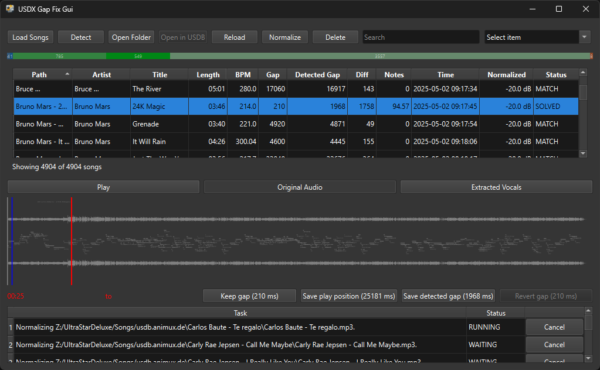

<p align="center"> 
    
    <h3 align="center">Effortlessly synchronize your Ultrastar Deluxe songs with AI-powered GAP detection and correction for the ultimate karaoke experience!</h3>
    <br/>
</p>
<p align="center"> 
    
    <br/>
</p>

# Ultrastar Deluxe (USDX) Fix Gap Gui

**Automatically fix timing issues in your UltraStar karaoke songs using AI-powered gap detection!**

Ultrastar Deluxe (USDX) Fix Gap Gui helps you quickly verify and correct GAP values in your UltraStar song collection. The GAP value defines when lyrics start (in milliseconds) - getting it right is crucial for a great karaoke experience.

### **Why do you need this?**

When downloading songs from [USDB](https://usdb.animux.de/) using [USDB Syncer](https://github.com/bohning/usdb_syncer), audio files are created from YouTube videos. This can cause timing mismatches:
- YouTube videos may have intro variations
- Community-set GAP values may not match your downloaded video
- Manual verification of hundreds of songs is time-consuming

**This tool solves these problems automatically** using AI to detect when vocals actually start, then suggests the correct GAP value with visual confirmation.

### **How it works**

1. **Load your song collection** - point to your UltraStar songs folder
2. **Detect gaps** - AI analyzes audio and finds vocal onset timing
3. **Review results** - see waveform visualization with detected vs. original GAP
4. **Apply fixes** - accept suggested values or fine-tune manually

The app uses state-of-the-art AI vocal separation (Meta's Demucs) with smart chunked processing to find the exact moment vocals start.

## ✨ Key Features

- 🎯 **AI-Powered Detection** - Uses Meta's Demucs for accurate vocal onset detection
- ⚡ **GPU Acceleration** - Optional NVIDIA GPU support for 5-10x faster processing ([Setup Guide](docs/gpu-acceleration.md))
- 📊 **Visual Waveforms** - See exactly where vocals start with clear visualizations
- 🎚️ **Audio Normalization** - Automatic volume adjustment for consistent playback
- 📈 **Confidence Scoring** - Know how reliable each detection is
- 🔄 **Batch Processing** - Fix hundreds of songs automatically
- 🎵 **Preview Generation** - Listen to detected timing before applying changes
- 💾 **Smart Caching** - Re-analyze only what changed, save time on re-runs
- 👁️ **Watch Mode** - Automatically monitor your song directory for changes and keep cache up-to-date

### **Detection Methods**

Choose the detection method that fits your needs:

- **MDX** (Recommended) - Fast GPU-accelerated chunked scanning with Meta's Demucs
  - ⚡ 10-30 seconds per song with GPU
  - 🎯 Smart early-stop when onset found
  - 🆕 Latest AI technology

- **Spleeter** (Legacy) - Full stem separation
  - ⚠️ Deprecated (unmaintained since 2020)
  - ~30-60 seconds per song
  - Requires TensorFlow dependencies

- **HQ Segment** (Legacy) - Windowed Spleeter
  - ⚠️ Deprecated (wrapper around unmaintained Spleeter)
  - ~15-25 seconds per song

> 💡 **Tip**: Use MDX with GPU acceleration for best performance. See [GPU Acceleration Guide](docs/gpu-acceleration.md) for setup instructions.

## 📖 User Guide

### **Basic Workflow**

1. **Load Songs**
   - Click "Load Songs" or File → Open Directory
   - Select your UltraStar songs folder
   - Songs are scanned and displayed in the table

2. **Detect Gaps**
   - Select songs (or use "Detect All")
   - Click "Detect Gap" button
   - AI analyzes audio and finds vocal onset timing
   - Results show: detected GAP, difference, confidence, status (MATCH/MISMATCH)

3. **Review Results**
   - Click any song to see its waveform
   - Green line = detected GAP
   - Red line = original GAP
   - Shaded area = confidence region
   - Listen to preview audio

4. **Apply Changes**
   - **Keep Original** - Dismiss detection, keep current value
   - **Save Detected** - Accept AI-suggested GAP
   - **Save Player Position** - Manually set GAP to current playback position
   - **Revert** - Undo changes, restore original GAP

5. **(Optional) Enable Watch Mode**
   - After loading songs, click the "Watch Mode" button
   - The app will monitor your song directory for changes:
     - New songs added → automatically scanned and added to the list
     - Songs deleted → removed from cache and list
     - Songs moved/renamed → cache updated with new paths
     - .txt/.mp3/.wav modified → gap detection automatically queued
   - Changes are debounced (500ms default) to avoid processing storms
   - Watch mode persists until manually disabled or app is closed

### **Interface Overview**

| Component | Description |
|-----------|-------------|
| **Song Table** | Shows all loaded songs with detection results |
| **Waveform Display** | Visual representation of audio with GAP markers |
| **Media Player** | Preview audio and navigate to specific timestamps |
| **Task Queue** | View ongoing/queued detection tasks |
| **Log Viewer** | Troubleshoot issues and monitor processing |
| **Watch Mode Button** | Toggle filesystem monitoring for automatic updates |

### **Understanding Results**

**Status Column**:
- ✅ **MATCH** - Detected GAP matches original (within tolerance)
- ⚠️ **MISMATCH** - Significant difference detected, review recommended
- 🔄 **PROCESSING** - Detection in progress
- ❌ **ERROR** - Detection failed, check logs

**Confidence Score**:
- **0.8-1.0** - Very confident, safe to auto-apply
- **0.6-0.8** - Good, manual review recommended
- **0.4-0.6** - Uncertain, definitely review
- **<0.4** - Low confidence, consider re-detecting or manual timing

> 💡 **Tip**: Sort by "Diff" column to find songs with largest timing errors first!

### **Watch Mode**

Watch Mode provides real-time monitoring of your song directory, automatically keeping your cache and gap detections up-to-date as you add, modify, or remove songs.

**Features**:
- 🔍 **Automatic Discovery** - New songs are instantly scanned and added
- 🔄 **Smart Updates** - Modified .txt or audio files trigger targeted gap detection
- 🗑️ **Cache Sync** - Deleted or moved songs are removed from cache
- ⚡ **Debouncing** - Rapid changes are coalesced to prevent processing storms
- 🎯 **Targeted Scanning** - Only changed songs are processed, not the entire directory

**How to Use**:
1. Load your song directory normally
2. Wait for initial scan to complete
3. Click "Watch Mode" button to enable (button becomes checkable and highlighted)
4. Make changes to your song directory (add/edit/delete songs)
5. Changes are automatically detected and processed
6. Click "Watch Mode" again to disable when done

**What's Monitored**:
- **Created** - New .txt files or folders → scheduled for scanning and cache update
- **Modified** - .txt/.mp3/.wav files → gap detection automatically queued
- **Deleted** - Songs removed → cache entries deleted, UI updated
- **Moved/Renamed** - Songs relocated → treated as delete + create

**Performance**:
- Uses OS-native filesystem monitoring (Windows ReadDirectoryChangesW, macOS FSEvents, Linux inotify)
- Default 500ms debounce prevents excessive processing during bulk operations
- Ignored patterns (.tmp, ~, .crdownload, .part) filter out temporary files
- At-most-one detection task per song prevents duplicates

**Configuration** (`config.ini`):
```ini
[WatchMode]
watch_mode_default = false         # Set to true to auto-enable on directory load
watch_debounce_ms = 500            # Wait time after last change before processing
watch_ignore_patterns = .tmp,~,.crdownload,.part  # Comma-separated patterns to ignore
```

> ⚠️ **Note**: Watch Mode requires the `watchdog` library. This is included in the standard installation and executables.

## 🚀 Quick Start

### **Option 1: Download Executable (Easiest)**

1. Download the latest release for your platform:
   - [Windows Release](https://github.com/vtietz/usdxfixgapgui/releases) (.exe)
   - [Linux Release](https://github.com/vtietz/usdxfixgapgui/releases) (AppImage)

2. **Install FFmpeg** (required):
   - Windows: Download from [ffmpeg.org](https://www.ffmpeg.org/download.html) and add to PATH
   - Linux: `sudo apt install ffmpeg` or `sudo pacman -S ffmpeg`
   - macOS: `brew install ffmpeg`

3. **Run the application** and start fixing gaps!

4. **(Optional) Enable GPU Acceleration**:
   - Have an NVIDIA GPU with driver ≥531? 
   - The app will automatically offer to download GPU Pack (~1GB) for 5-10x faster processing
   - [→ GPU Acceleration Guide](docs/gpu-acceleration.md)

### **Option 2: Run from Source (For Developers)**

#### **Easy Way (Recommended)**

```bash
# Windows
.\run.bat start

# Linux/macOS
./run.sh start
```

The run script automatically handles environment setup and dependencies!

#### **Manual Setup**

<details>
<summary>Click to expand manual installation steps</summary>

1. **Create virtual environment:**
   ```bash
   # Windows (prefer py launcher)
   py -3.10 -m venv .venv
   # Or fallback to:
   python -m venv .venv
   
   # Linux/macOS
   python3 -m venv .venv
   ```

2. **Install dependencies:**
   ```bash
   # Windows
   .venv\Scripts\pip.exe install -r requirements.txt
   
   # Linux/macOS
   .venv/bin/pip install -r requirements.txt
   ```

3. **Run the application:**
   ```bash
   # Windows
   cd src
   .venv\Scripts\python.exe usdxfixgap.py
   
   # Linux/macOS
   cd src
   .venv/bin/python usdxfixgap.py
   ```

4. **(Optional) GPU Setup:**
   - See [GPU Acceleration Guide](docs/gpu-acceleration.md) for CUDA installation

</details>

### **Using the Run Scripts**

The provided run scripts (`run.bat` / `run.sh`) make development easy:

```bash
# Show available commands
.\run.bat          # Windows
./run.sh           # Linux/macOS

# Common commands
.\run.bat start    # Start the application
.\run.bat test     # Run tests
.\run.bat install  # Install/update dependencies
.\run.bat clean    # Clean cache files
.\run.bat info     # Show environment info
```

> 💡 **Note**: Run scripts automatically detect NVIDIA GPU and install CUDA support if available!

## ⚙️ Configuration

Configuration is stored in `config.ini` (location: `%LOCALAPPDATA%\USDXFixGap\config.ini` on Windows, `~/.local/share/USDXFixGap/config.ini` on Linux).

Most settings can be adjusted through the GUI (File → Preferences). For detailed explanation of all configuration options, see the **[Configuration Reference](docs/configuration.md)**.

### **Quick Configuration Tips**

**Enable GPU Acceleration** (5-10x faster):
```ini
[General]
GpuOptIn = true
```

**Change Detection Method**:
```ini
[Processing]
method = mdx    # Recommended: mdx, spleeter (legacy), hq_segment (legacy)
```

**Adjust Gap Tolerance** (default: 500ms):
```ini
[Detection]
gap_tolerance = 500    # Milliseconds - gaps larger than this are flagged as MISMATCH
```

**Suppress GPU Pack Dialog** (if you don't want GPU acceleration):
```ini
[General]
GpuPackDialogDontShow = true
```

**Watch Mode Settings**:
```ini
[WatchMode]
watch_mode_default = false         # Auto-enable watch mode on directory load
watch_debounce_ms = 500            # Milliseconds to wait after file changes before processing
watch_ignore_patterns = .tmp,~,.crdownload,.part  # File patterns to ignore
```

See **[Configuration Reference](docs/configuration.md)** for all available settings and their valid values.

## 🛠️ For Developers

Want to contribute or understand how the code works?

### **Documentation**

- **[Development Guide](docs/DEVELOPMENT.md)** - Setup, testing, code quality tools, building executables
- **[Architecture Guide](docs/architecture.md)** - System design, component responsibilities, signal patterns
- **[Coding Standards](docs/coding-standards.md)** - DRY principles, SOLID patterns, testing guidelines
- **[Signal Usage Guide](docs/signals.md)** - Event communication patterns and best practices
- **[Configuration Reference](docs/configuration.md)** - Complete config.ini settings documentation
- **[GPU Acceleration](docs/gpu-acceleration.md)** - GPU Pack setup, troubleshooting, architecture
- **[Performance Optimization](docs/performance-optimization.md)** - Qt TableView optimization patterns

### **Development Setup**

```bash
# Clone repository
git clone https://github.com/vtietz/usdxfixgapgui.git
cd usdxfixgapgui

# Install dependencies (auto-detects GPU)
.\run.bat install     # Windows
./run.sh install      # Linux/macOS

# Install development tools (testing, code analysis)
.\run.bat install-dev # Windows
./run.sh install-dev  # Linux/macOS

# Run tests
.\run.bat test        # 78 tests should pass

# Run code quality analysis
.\run.bat analyze     # Check complexity and style

# Start development
.\run.bat start
```

**For detailed setup and workflow**, see the **[Development Guide](docs/DEVELOPMENT.md)**.

### **Project Structure**

```
src/
├── actions/       # Orchestration layer (business workflow)
├── services/      # Business logic (stateless operations)
├── model/         # Data structures and state
├── ui/            # PySide6 user interface components
├── workers/       # Background tasks and async operations
├── utils/         # Shared utilities and helpers
└── app/           # Application state and DI container
```

### **Architecture Highlights**

- **Layered Architecture**: Models → Services → Actions → UI
- **Dependency Injection**: AppData container for loose coupling
- **Signal-Based Communication**: Asynchronous event-driven updates
- **Worker Queue**: Background task management with cancellation
- **Provider Pattern**: Pluggable detection methods (MDX, Spleeter, HQ Segment)

### **Testing**

All code changes should include tests:

```bash
# Run all tests
.\run.bat test

# Run specific test file
.\run.bat pytest tests/test_gap_actions_detect_gap_finished.py -v

# Check test coverage
.\run.bat pytest --cov=src tests/
```

See [Coding Standards](docs/coding-standards.md) for testing guidelines.

### **Building Executables**

```bash
# Windows
build.bat

# Linux/macOS
./build_linux.sh    # or ./build_macos.sh
```

Output in `build/usdxfixgap/` directory.

## 🤝 Contributing

Contributions are welcome! Whether it's bug reports, feature requests, or code contributions:

1. **Fork the repository**
2. **Create a feature branch**: `git checkout -b feature/amazing-feature`
3. **Make your changes** (follow [Coding Standards](docs/coding-standards.md))
4. **Run tests**: `.\run.bat test` (all tests must pass)
5. **Commit your changes**: `git commit -m 'Add amazing feature'`
6. **Push to branch**: `git push origin feature/amazing-feature`
7. **Open a Pull Request**

### **Reporting Issues**

Found a bug? Have a suggestion?

1. Check [existing issues](https://github.com/vtietz/usdxfixgapgui/issues)
2. Create a new issue with:
   - Clear description of the problem/request
   - Steps to reproduce (for bugs)
   - Your environment (OS, Python version, GPU if relevant)
   - Relevant logs (from log viewer or `gpu_diagnostics.txt`)

## 📄 License

This project is licensed under the MIT License. See the [LICENSE](LICENSE) file for details.

## 🙏 Acknowledgements

This project wouldn't be possible without these amazing open-source projects:

- **[Demucs](https://github.com/facebookresearch/demucs)** by Meta Research - State-of-the-art music source separation
- **[PyTorch](https://pytorch.org/)** - Deep learning framework powering AI detection
- **[Spleeter](https://github.com/deezer/spleeter)** by Deezer - Original vocal separation (legacy support)
- **[FFmpeg](https://github.com/FFmpeg/FFmpeg)** - Audio processing and normalization
- **[PySide6](https://www.qt.io/qt-for-python)** - Cross-platform GUI framework
- **[USDB](https://usdb.animux.de/)** - Community karaoke song database
- **[USDB Syncer](https://github.com/bohning/usdb_syncer)** - Download tool for USDB songs

Special thanks to the UltraStar Deluxe community for keeping karaoke alive! 🎤

---

**Made with ❤️ for the UltraStar community**

If this tool helped you fix your songs, consider ⭐ starring the repo!
