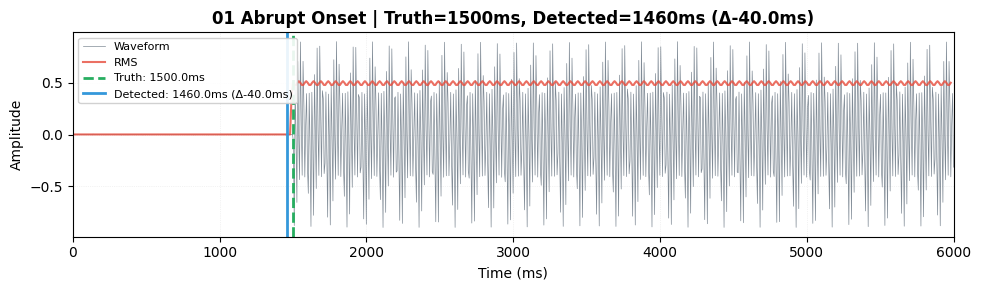
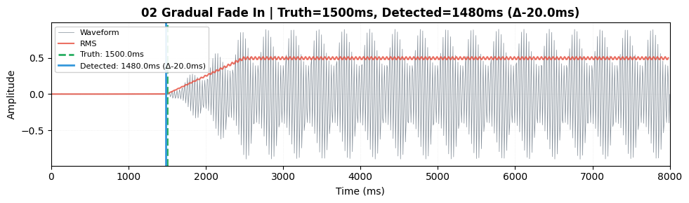
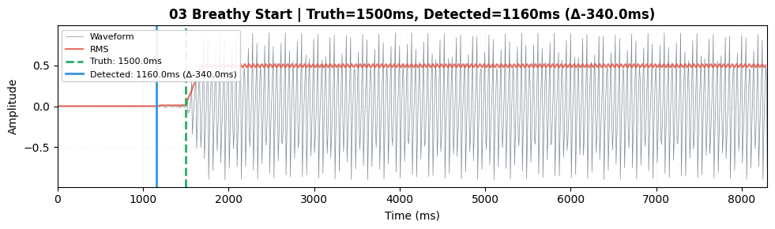
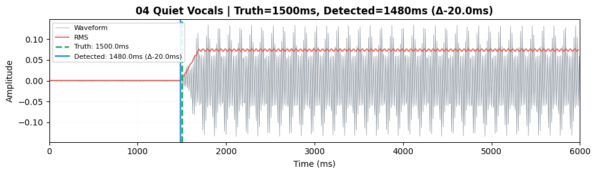
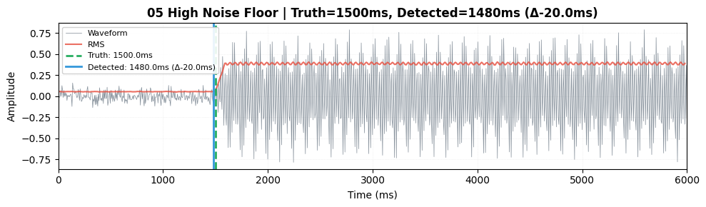
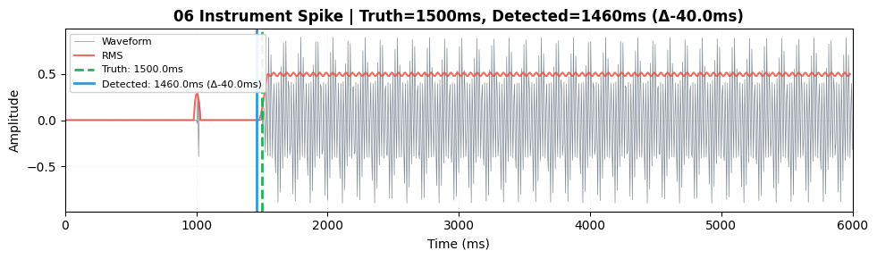
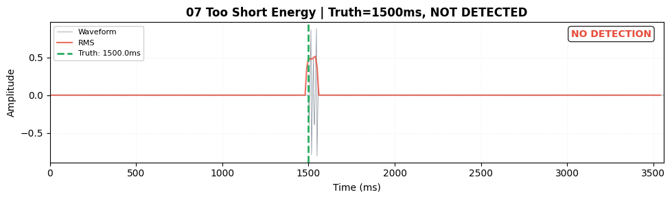
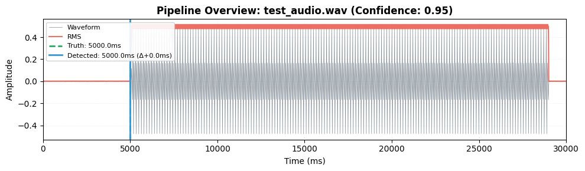

# Gap Detection Tests

**Status**: ✅ 46 tests passing  
**Coverage**: Energy detection, scanner orchestration, pipeline integration  
**Test Files**: `tests/gap_scenarios/test_tier*.py`

---

## Running Tests

```bash
# All gap detection tests
.\run.bat test tests/gap_scenarios/ -v

# With visual artifacts (generates PNG images)
.\run.bat test --docs

# Test with your config.ini values (validate your settings)
$env:GAP_TEST_USE_CONFIG_INI='1'; .\.venv\Scripts\python.exe -m pytest tests/gap_scenarios/ -v

# Generate artifacts using your config.ini values
$env:GAP_TIER1_WRITE_DOCS='1'; $env:GAP_TIER3_WRITE_DOCS='1'; $env:GAP_TEST_USE_CONFIG_INI='1'; .\.venv\Scripts\python.exe -m pytest tests/gap_scenarios/ -v

# Specific test suites
.\run.bat test tests/gap_scenarios/test_tier1_detection_energy.py -v
.\run.bat test tests/gap_scenarios/test_tier2_scanner*.py -v
.\run.bat test tests/gap_scenarios/test_tier3_pipeline_perform.py -v
```

### Config Testing

By default, tests use **hard-coded values** for predictable, fast results. 

To test with your actual **config.ini** values:
```powershell
$env:GAP_TEST_USE_CONFIG_INI='1'
.\.venv\Scripts\python.exe -m pytest tests/gap_scenarios/test_tier2_scanner*.py -v
```

This validates your MDX settings (chunk sizes, windows, thresholds) work correctly.

---

## Test Suite Structure

### Level 1: Energy-Based Onset Detection (13 tests)
**Target**: [`detect_onset_in_vocal_chunk()`](../../src/utils/providers/mdx/detection.py)  
**Scope**: Pure energy-based detection logic on synthetic vocals  
**Execution**: ~1-2 seconds

#### Detection Parameters

| Parameter | Default | Description |
|-----------|---------|-------------|
| `frame_duration_ms` | 25 ms | RMS analysis frame size |
| `hop_duration_ms` | 20 ms | RMS hop size |
| `noise_floor_duration_ms` | 1000 ms | Noise floor estimation window |
| `onset_snr_threshold` | 4.0 σ | SNR threshold above noise |
| `onset_abs_threshold` | 0.01 | Absolute RMS threshold |
| `min_voiced_duration_ms` | 300 ms | Minimum sustained duration |
| `hysteresis_ms` | 200 ms | Onset refinement window |

**Threshold Logic**: `max(SNR_threshold, absolute_threshold)`

#### Scenarios

| # | Scenario | Ground Truth | Tolerance | Image |
|---|----------|--------------|-----------|-------|
| 1 | Abrupt onset | 1500 ms | ±50 ms |  |
| 2 | Gradual fade-in (1000ms) | 1500 ms | ±200 ms |  |
| 3 | Breathy start (300ms preroll) | 1500 ms | ±150 ms |  |
| 4 | Quiet vocals (low SNR) | 1500 ms | ±250 ms |  |
| 5 | High noise floor (-24dB) | 1500 ms | ±200 ms |  |
| 6 | Instrument spike (false positive guard) | 1500 ms | ±150 ms |  |
| 7 | Too short energy (<300ms) | N/A | No detection |  |
| 8 | Extremely short audio (<25ms) | N/A | No detection | — |
| 9 | Sensitivity sweep (4 variants) | 1500 ms | Varies | Multiple |

**Key Validations**:
- ✅ Threshold crossing detection
- ✅ Sustained minimum duration requirement
- ✅ Energy derivative refinement for fade-ins
- ✅ False-positive rejection (short bursts)
- ✅ Combined SNR + absolute threshold logic
- ✅ Graceful handling of edge cases

---

### Level 2: Scanner Orchestration (13 tests)
**Target**: [`scan_for_onset()`](../../src/utils/providers/mdx/scanner/pipeline.py)  
**Scope**: Integration with chunk iterator, expansion strategy, stubbed separation  
**Execution**: ~2.7 seconds

#### Test Infrastructure

**Audio Format**: Stereo WAV files
- **Left channel**: Mixture (vocals + instruments)
- **Right channel**: Isolated vocals (ground truth)

**Stub Separator**: Returns right channel without running Demucs

#### Test Files

**Metadata Alignment** (`test_tier2_scanner_metadata_alignment.py` - 5 tests):

| # | Onset | Expected | Tolerance | Focus |
|---|-------|----------|-----------|-------|
| 1 | 5000ms | 5000ms | ±100ms | Exact match |
| 2 | 5400ms | 5000ms | ±150ms | Close match (first window) |
| 3 | 7000ms | 5000ms | ±200ms | Moderate offset |
| 4 | 20000ms | 2000ms | ±300ms | Multiple expansions required |
| 5 | 5100ms | 5000ms | ±200ms | Early-stop optimization |

**Edge Cases** (`test_tier2_scanner_edge_cases.py` - 5 tests):

| # | Scenario | Expected Behavior |
|---|----------|------------------|
| 6 | Early vocals (1000ms) vs late expected (8000ms) | Detects in first expansion |
| 7 | Multiple onsets (2000ms, 21000ms) | Chooses closest to expected |
| 8 | No vocals (silent channel) | Returns `None` gracefully |
| 9 | Very late vocals (70s) vs early expected (2s) | Max window limit handling |
| 10 | Quiet vocals with loud instruments | Clean separation (stub) |

**Performance & Optimization** (`test_tier2_scanner_performance.py` - 3 tests):

| # | Focus | Validation |
|---|-------|------------|
| 11 | VocalsCache reuse | No redundant separation |
| 12 | Early-stop optimization | Stops when within tolerance |
| 13 | Resample to 44100 | Timing accuracy preserved |

**Key Validations**:
- ✅ Expanding window search strategy
- ✅ Chunk iteration with deduplication
- ✅ Early-stop when onset within tolerance
- ✅ Multiple onset handling (choose closest)
- ✅ VocalsCache prevents redundant work
- ✅ Sample rate robustness (48kHz → 44.1kHz)
- ✅ Graceful failure modes

---

### Level 3: Pipeline Integration (7 tests)
**Target**: [`perform()`](../../src/utils/gap_detection/pipeline.py)  
**Scope**: End-to-end pipeline with stubbed provider  
**Execution**: ~3.3 seconds

#### Test Infrastructure

**StubProvider** (`tests/test_utils/provider_stub.py`):
- Implements `IDetectionProvider` interface
- `get_vocals_file()`: Extracts right channel as vocals
- `detect_silence_periods()`: Returns `[(0, truth_onset_ms)]`
- `compute_confidence()`: Returns fixed value
- Call tracking for verification

**ConfigStub** (`tests/test_utils/config_stub.py`):
- Minimal Config duck-type
- Fields: `tmp_root`, `method`, detection times, MDX settings

#### Scenarios

| # | Test | Setup | Validates | Image |
|---|------|-------|-----------|-------|
| 1 | Exact match | Onset=5000ms, gap=5000ms | Accuracy ±50ms, confidence |  |
| 2 | No silence | Vocals at start | Returns gap=0 |  |
| 3 | Confidence propagation | Low confidence (0.35) | Value flows through | — |
| 4 | Existing vocals respected | Pre-existing file, overwrite=False | Skips re-extraction | — |
| 5 | Provider reuse | Multiple steps | Same instance used | — |
| 6 | Large offset | Onset=20000ms (in 30s window) | Late gap detection | — |
| 7 | Failure handling | Provider raises error | Exception propagates | — |

**Key Validations**:
- ✅ Provider reuse across get_vocals/detect_silence/compute_confidence
- ✅ Silence period evaluation (picks closest to original_gap)
- ✅ Vocals file caching (overwrite=False)
- ✅ Confidence propagation end-to-end
- ✅ Error handling (no silent failures)
- ✅ Monkeypatch strategy at usage site

**Silence Period Logic**:
```python
# perform() evaluates BOTH start and end
silence = [(0, 5000)]
original_gap = 5000
# → picks end=5000 (diff=0 vs start diff=5000)
```

---

## Visual Artifacts

Generated with `.\run.bat test --docs`:

```
docs/gap-tests/
├── tier1/           # Energy detection waveforms (13 images)
│   ├── 01-abrupt-onset.png
│   ├── 02-gradual-fade-in.png
│   ├── 03-breathy-start.png
│   └── ...
└── tier3/           # Pipeline overview plots (7 images)
    ├── 01-exact-match.png
    ├── 02-no-silence.png
    └── ...
```

**Image Format**: Blue waveform + RMS overlay (red), truth onset (green dashed), detected onset (blue solid), delta error in legend

---

## Test Architecture

```
       Level 3: Pipeline (E2E with stub)     ← 7 tests, ~3.3s
      /                                   \
     Level 2: Scanner (integration)        ← 13 tests, ~2.7s
    /                                       \
   Level 1: Energy (pure logic)             ← 13 tests, ~1-2s
```

**Benefits**:
- **Speed**: No Demucs loading (~100x faster than real separation)
- **Determinism**: Ground truth = right channel (no model variance)
- **Isolation**: Tests logic without separation quality concerns
- **CI-Friendly**: No GPU required, runs in seconds

---

## Environment Variables

- `GAP_TIER1_WRITE_DOCS=1` - Generate Level 1 waveform images
- `GAP_TIER3_WRITE_DOCS=1` - Generate Level 3 pipeline plots

Both set automatically with `.\run.bat test --docs`

---

## Related Documentation

- [MDX Detection Code](../../src/utils/providers/mdx/detection.py)
- [MDX Scanner Pipeline](../../src/utils/providers/mdx/scanner/pipeline.py)
- [Gap Detection Pipeline](../../src/utils/gap_detection/pipeline.py)
- [MDX Detection Tuning Guide](../mdx-detection-tuning.md)
- [Architecture Overview](../architecture.md)
