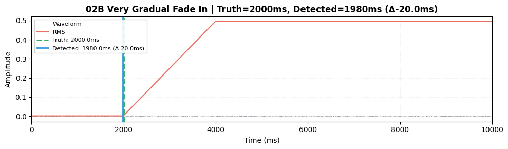
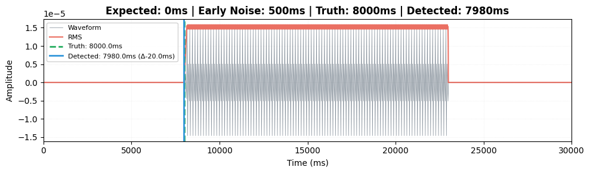
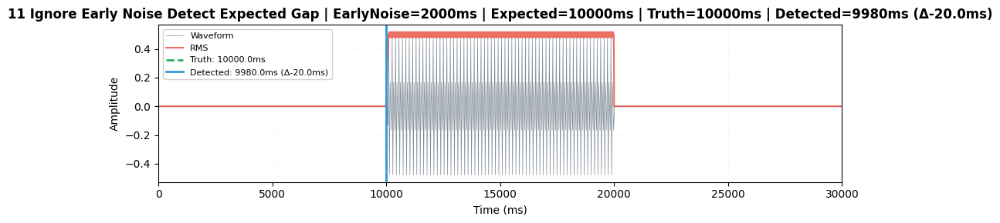
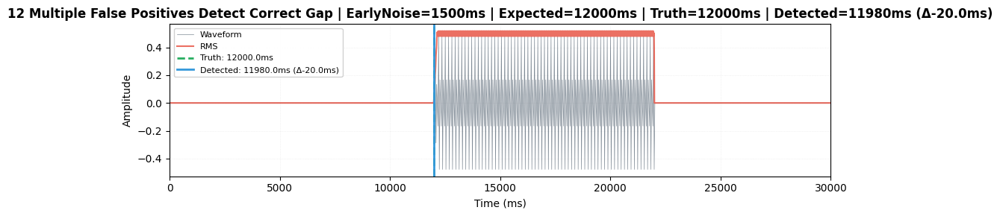
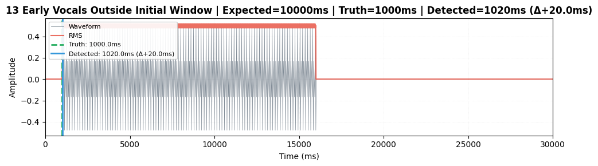
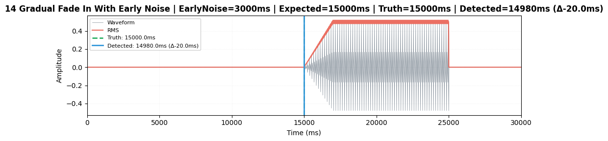

# Gap Detection Tests

**Status**: ✅ 665 tests passing (39 gap-specific scenarios)
**Coverage**: Energy detection, scanner orchestration, gap-focused search, pipeline integration
**Test Files**: `tests/gap_scenarios/test_tier*.py`

---

## Running Tests

```bash
# All gap detection tests
.\run.bat test tests/gap_scenarios/ -v

# With visual artifacts (generates PNG images)
.\run.bat test --docs

# Specific test suites
.\run.bat test tests/gap_scenarios/test_tier1_detection_energy.py -v
.\run.bat test tests/gap_scenarios/test_tier2_scanner*.py -v
.\run.bat test tests/gap_scenarios/test_tier3_pipeline_perform.py -v
```

### Testing with Custom Detection Parameters

To experiment with different detection parameter values, simply create a custom config file:

**1. Create `tests/custom_config.ini`** (this file is gitignored):
```ini
[mdx]
onset_snr_threshold = 6.0
onset_abs_threshold = 0.015
min_voiced_duration_ms = 200
hysteresis_ms = 300
# ... other MDX parameters as needed
```

**2. Run tests** - they will **automatically** use your custom parameters:
```bash
.\run.bat test tests/gap_scenarios/
```

**That's it!** No code changes needed. The test fixtures automatically detect `tests/custom_config.ini` and load it. When the file is removed, tests revert to hard-coded defaults.

**Use cases:**
- Tune detection for very quiet intros
- Test aggressive thresholds for gradual fade-ins
- Validate settings before applying to production config.ini

**Note:** This is for **local experimentation only**. Standard tests (without custom_config.ini) use hard-coded values for consistency and CI/CD predictability.

---

## Test Suite Structure

### Level 1: Energy-Based Onset Detection (13 tests)
**Target**: [`detect_onset_in_vocal_chunk()`](../../src/utils/providers/mdx/detection.py)
**Scope**: Pure energy-based detection logic on synthetic vocals
**Execution**: ~1-2 seconds

#### Detection Parameters

| Parameter | Default | Description |
|-----------|---------|-------------|
| `frame_duration_ms` | 25 ms | RMS analysis frame size |
| `hop_duration_ms` | 20 ms | RMS hop size |
| `noise_floor_duration_ms` | 300 ms | Noise floor estimation window (reduced to avoid including early vocals) |
| `onset_snr_threshold` | 2.5 σ | SNR threshold above noise (reduced for early quiet vocals) |
| `onset_abs_threshold` | 0.008 | Absolute RMS threshold (reduced for sensitivity) |
| `min_voiced_duration_ms` | 100 ms | Minimum sustained duration (reduced to catch earlier onsets) |
| `hysteresis_ms` | 200 ms | Onset refinement window |

**Threshold Logic**: `max(SNR_threshold, absolute_threshold)`

#### Scenarios

| # | Scenario | Ground Truth | Tolerance | Image |
|---|----------|--------------|-----------|-------|
| 1 | Abrupt onset | 1500 ms | ±50 ms |  |
| 2 | Gradual fade-in (1000ms) | 1500 ms | ±200 ms |  |
| 2b | Very gradual fade-in (2000ms) | 2000 ms | ±300 ms |  |
| 3 | Breathy start (300ms preroll) | 1500 ms | ±150 ms |  |
| 4 | Quiet vocals (low SNR) | 1500 ms | ±250 ms |  |
| 4b | Early quiet vocals + later louder (Britney scenario) | 500 ms | ±400 ms |  |
| 5 | High noise floor (-24dB) | 1500 ms | ±200 ms |  |
| 6 | Instrument spike (false positive guard) | 1500 ms | ±150 ms |  |
| 7 | Too short energy (<300ms) | N/A | No detection |  |
| 8 | Extremely short audio (<25ms) | N/A | No detection | — |
| 9 | Sensitivity sweep (4 variants) | 1500 ms | Varies | Multiple |

**Key Validations**:
- ✅ Threshold crossing detection
- ✅ Sustained minimum duration requirement
- ✅ Energy derivative refinement for fade-ins
- ✅ False-positive rejection (short bursts)
- ✅ Combined SNR + absolute threshold logic
- ✅ Graceful handling of edge cases

---

### Level 2: Scanner Orchestration (19 tests)
**Target**: [`scan_for_onset()`](../../src/utils/providers/mdx/scanner/pipeline.py)
**Scope**: Integration with chunk iterator, expansion strategy, stubbed separation
**Execution**: ~3.7 seconds

#### Test Infrastructure

**Audio Format**: Stereo WAV files
- **Left channel**: Mixture (vocals + instruments)
- **Right channel**: Isolated vocals (ground truth)

**Stub Separator**: Returns right channel without running Demucs

#### Test Files

**Metadata Alignment** (`test_tier2_scanner_metadata_alignment.py` - 5 tests):

| # | Onset | Expected | Tolerance | Focus |
|---|-------|----------|-----------|-------|
| 1 | 5000ms | 5000ms | ±100ms | Exact match |
| 2 | 5400ms | 5000ms | ±150ms | Close match (first window) |
| 3 | 7000ms | 5000ms | ±200ms | Moderate offset |
| 4 | 20000ms | 2000ms | ±300ms | Multiple expansions required |
| 5 | 5100ms | 5000ms | ±200ms | Early-stop optimization |

**Edge Cases** (`test_tier2_scanner_edge_cases.py` - 6 tests):

| # | Scenario | Expected Behavior | Image |
|---|----------|-------------------|-------|
| 6 | Early vocals (1000ms) vs late expected (8000ms) | Detects in first expansion | — |
| 7 | Multiple onsets (2000ms, 21000ms) | Chooses closest to expected | — |
| 8 | No vocals (silent channel) | Returns `None` gracefully | — |
| 9 | Very late vocals (70s) vs early expected (2s) | Max window limit handling | — |
| 10 | Quiet vocals with loud instruments | Clean separation (stub) | — |
| 11 | Gap=0ms with instrumental intro → vocals at 8000ms | Filters out very early onsets (< 800ms) |  |

**Performance & Optimization** (`test_tier2_scanner_performance.py` - 3 tests):

| # | Focus | Validation |
|---|-------|------------|
| 11 | VocalsCache reuse | No redundant separation |
| 12 | Early-stop optimization | Stops when within tolerance |
| 13 | Resample to 44100 | Timing accuracy preserved |

**Gap-Focused Search** (`test_tier2_gap_focused_search.py` - 5 tests):

These tests validate the v2.4+ gap-focused search strategy that prevents false positive detections. The scanner centers the search window around `expected_gap_ms` and uses distance-based gating to ensure the expected region is analyzed:

```python
# Distance-based gating (v2.4+)
band_start = max(0.0, expected_gap_ms - search_limit_ms)
band_end = min(total_duration_ms, expected_gap_ms + search_limit_ms)
# First iteration: [expected_gap ± 20s] band
```

This strategy solves two critical issues:
1. **False positives from early artifacts**: Early backing vocals/noise outside the band are ignored
2. **Expected region not analyzed**: Previously, absolute-time gating (`if chunk.start_ms >= 20s: skip`) prevented analysis of late gaps (e.g., 37.8s)

| # | Scenario | Early Noise | Vocals | Expected | Validates | Image |
|---|----------|-------------|--------|----------|-----------|-------|
| 11 | Ignore early noise, detect at expected | 2000ms | 10000ms | 10000ms | False positive rejection |  |
| 12 | Multiple false positives (1500, 3500, 5000ms) | Yes | 12000ms | 12000ms | Robust filtering |  |
| 13 | Early vocals with late expected | No | 1000ms | 10000ms | Expansion fallback |  |
| 14 | Gradual fade-in + early noise | 3000ms | 15000ms | 15000ms | Combined challenges |  |
| 15 | Late expected gap (37.8s) + early backing | 25000ms | 37800ms | 38000ms | Distance gating processes expected region |  |

**Key Validations**:
- ✅ **Gap-focused search** - Centers window around expected_gap_ms (v2.4)
- ✅ **False positive rejection** - Ignores noise outside search window
- ✅ Expanding window search strategy
- ✅ Chunk iteration with deduplication
- ✅ Early-stop when onset within tolerance
- ✅ Multiple onset handling (choose closest)
- ✅ VocalsCache prevents redundant work
- ✅ Sample rate robustness (48kHz → 44.1kHz)
- ✅ Graceful failure modes

---

### Level 3: Pipeline Integration (7 tests)
**Target**: [`perform()`](../../src/utils/gap_detection/pipeline.py)
**Scope**: End-to-end pipeline with stubbed provider
**Execution**: ~3.3 seconds

#### Test Infrastructure

**StubProvider** (`tests/test_utils/provider_stub.py`):
- Implements `IDetectionProvider` interface
- `get_vocals_file()`: Extracts right channel as vocals
- `detect_silence_periods()`: Returns `[(0, truth_onset_ms)]`
- `compute_confidence()`: Returns fixed value
- Call tracking for verification

**ConfigStub** (`tests/test_utils/config_stub.py`):
- Minimal Config duck-type
- Fields: `tmp_root`, `method`, detection times, MDX settings

#### Scenarios

| # | Test | Setup | Validates | Image |
|---|------|-------|-----------|-------|
| 1 | Exact match | Onset=5000ms, gap=5000ms | Accuracy ±50ms, confidence |  |
| 2 | No silence | Vocals at start | Returns gap=0 |  |
| 3 | Confidence propagation | Low confidence (0.35) | Value flows through | — |
| 4 | Existing vocals respected | Pre-existing file, overwrite=False | Skips re-extraction | — |
| 5 | Provider reuse | Multiple steps | Same instance used | — |
| 6 | Large offset | Onset=20000ms (in 30s window) | Late gap detection | — |
| 7 | Failure handling | Provider raises error | Exception propagates | — |

**Key Validations**:
- ✅ Provider reuse across get_vocals/detect_silence/compute_confidence
- ✅ Silence period evaluation (picks closest to original_gap)
- ✅ Vocals file caching (overwrite=False)
- ✅ Confidence propagation end-to-end
- ✅ Error handling (no silent failures)
- ✅ Monkeypatch strategy at usage site

**Silence Period Logic**:
```python
# perform() evaluates BOTH start and end
silence = [(0, 5000)]
original_gap = 5000
# → picks end=5000 (diff=0 vs start diff=5000)
```

---

## Visual Artifacts

Generated with `.\run.bat test --docs`:

```
docs/gap-tests/
├── tier1/           # Energy detection waveforms (12 images)
│   ├── 01-abrupt-onset.png
│   ├── 02-gradual-fade-in.png
│   ├── 02b-very-gradual-fade-in.png
│   ├── 03-breathy-start.png
│   ├── 04-quiet-vocals.png
│   ├── 05-high-noise-floor.png
│   ├── 06-instrument-spike.png
│   ├── 07-too-short-energy.png
│   └── 09-sensitivity-*.png (4 variants)
├── tier2/           # Scanner orchestration (6 images) - v2.4+
│   ├── 11-ignore-early-noise-detect-expected-gap.png
│   ├── 11-zero-gap-with-late-vocals.png
│   ├── 12-multiple-false-positives-detect-correct-gap.png
│   ├── 13-early-vocals-outside-initial-window.png
│   ├── 14-gradual-fade-in-with-early-noise.png
│   └── 15-expected-band-distance-gating.png
└── tier3/           # Pipeline overview plots (2 images)
    ├── 01-exact-match.png
    └── 02-no-silence-periods.png
```

**Image Format**: Blue waveform + RMS overlay (red), truth onset (green dashed), detected onset (blue solid), delta error in legend

**Tier-2 Images** (Gap-Focused Search Validation):
- Show early noise markers (ignored outside search window)
- Display expected_gap_ms position (search center)
- Visualize detection accuracy near expected gap
- Prove false positive rejection works

---

## Test Architecture

```
       Level 3: Pipeline (E2E with stub)     ← 7 tests, ~3.3s
      /                                   \
     Level 2: Scanner (integration)        ← 13 tests, ~2.7s
    /                                       \
   Level 1: Energy (pure logic)             ← 13 tests, ~1-2s
```

**Benefits**:
- **Speed**: No Demucs loading (~100x faster than real separation)
- **Determinism**: Ground truth = right channel (no model variance)
- **Isolation**: Tests logic without separation quality concerns
- **CI-Friendly**: No GPU required, runs in seconds

---

## Environment Variables

- `GAP_WRITE_DOCS=1` - Generate all test artifacts (tier1, tier2, tier3 images)

Set automatically with `.\run.bat test --docs`

---

## Related Documentation

- [MDX Detection Code](../../src/utils/providers/mdx/detection.py)
- [MDX Scanner Pipeline](../../src/utils/providers/mdx/scanner/pipeline.py)
- [Gap Detection Pipeline](../../src/utils/gap_detection/pipeline.py)
- [Configuration Reference - MDX Detection Tuning](../configuration.md#mdx-detection-tuning)
- [Architecture Overview](../architecture.md)
