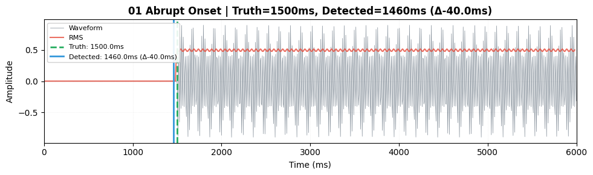
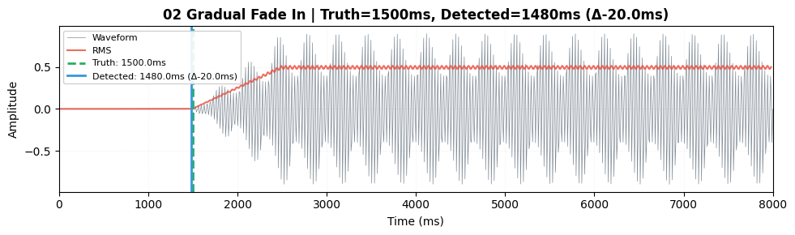
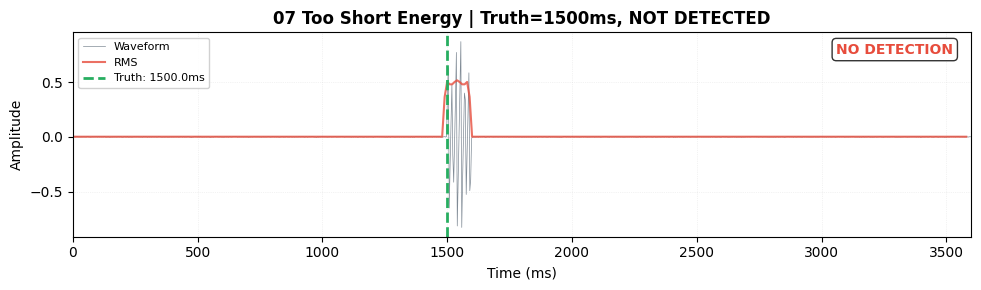

# Tier-1 Gap Detection Tests: Energy-Based Onset Detection

**Scope:** Unit tests for pure energy-based onset detection on synthetic vocal stems.  
**Target Code:** [`detect_onset_in_vocal_chunk()`](../../src/utils/providers/mdx/detection.py)

---

## Overview

Tier-1 tests validate the core onset detection logic without file I/O, Demucs separation, or scanner integration. Tests directly call `detect_onset_in_vocal_chunk()` with deterministic synthetic waveforms representing various vocal onset scenarios.

### Detection Parameters (Default Config)

| Parameter | Default Value | Description |
|-----------|---------------|-------------|
| `frame_duration_ms` | 25 ms | RMS analysis frame size |
| `hop_duration_ms` | 20 ms | RMS hop size (frame advance) |
| `noise_floor_duration_ms` | 1000 ms | Duration used to estimate noise floor |
| `onset_snr_threshold` | 4.0 σ | SNR threshold (noise floor + 4×sigma) |
| `onset_abs_threshold` | 0.01 | Absolute RMS threshold |
| `min_voiced_duration_ms` | 300 ms | Minimum sustained energy duration |
| `hysteresis_ms` | 200 ms | Lookback window for onset refinement |

**Combined Threshold:** Detection uses `max(SNR_threshold, absolute_threshold)` to handle both quiet and noisy scenarios.

---

## Test Scenarios

### Scenario 1: Abrupt Onset (Easy Detection)

**Description:** Clean harmonic tone starting immediately without fade-in.  
**Ground Truth:** 1500 ms  
**Acceptance:** Detection within ±50 ms  
**Validates:** Threshold crossing, sustained minimum duration requirement.



**Parameters:**
- Onset: 1500 ms
- Fade-in: 0 ms (abrupt)
- Noise floor: -60 dB
- F0: 220 Hz, 4 harmonics

---

### Scenario 2: Gradual Fade-In (Slow Energy Rise)

**Description:** Tone with 1000ms linear fade-in from onset position.  
**Ground Truth:** 1500 ms  
**Acceptance:** Detection within ±200 ms  
**Validates:** Energy derivative refinement finds first consistent rise.



**Parameters:**
- Onset: 1500 ms
- Fade-in: 1000 ms (gradual)
- Noise floor: -60 dB
- F0: 220 Hz, 4 harmonics

---

### Scenario 3: Breathy Start (Low-Level Noise Pre-Roll)

**Description:** 300ms breath noise at -40dB before vocal onset with 200ms fade-in.  
**Ground Truth (Reference):** 1500 ms (pure vocal onset)  
**Acceptance:** Detection between 1100ms (breath start) and 1650ms (vocal onset + tolerance)  
**Validates:** Energy detection in presence of pre-vocal breath artifacts. Algorithm correctly detects the combined breath+vocal energy rise.


**Parameters:**
- Onset: 1500 ms
- Breath preroll: 300 ms at -40 dB
- Fade-in: 200 ms
- Noise floor: -60 dB
- F0: 220 Hz, 4 harmonics

---

### Scenario 4: Quiet Vocals Near Threshold (Low SNR)

**Description:** Reduced amplitude so early RMS barely exceeds combined threshold.  
**Ground Truth:** 1500 ms  
**Acceptance:** Detection within ±250 ms  
**Validates:** Combined threshold logic (max of absolute and SNR threshold).


**Parameters:**
- Onset: 1500 ms
- Fade-in: 200 ms
- Noise floor: -50 dB (higher noise)
- Amplitude: 0.15× (reduced)
- F0: 220 Hz, 4 harmonics

---

### Scenario 5: High Noise Floor Baseline

**Description:** Very high noise floor (-24dB) with adequate tone amplitude to exceed noise + k×σ.  
**Ground Truth:** 1500 ms  
**Acceptance:** Detection within ±200 ms  
**Validates:** SNR threshold scales correctly with sigma.


**Parameters:**
- Onset: 1500 ms
- Fade-in: 100 ms
- Noise floor: -24 dB (very high)
- F0: 220 Hz, 4 harmonics

---

### Scenario 6: Instrument Spike Before Onset (False Positive Guard)

**Description:** Short 30ms transient spike at t=1000ms before vocal onset at 1500ms.  
**Ground Truth:** 1500 ms (vocal onset, not spike)  
**Acceptance:** Detection within ±150 ms  
**Validates:** `min_voiced_duration_ms` filters out short bursts.


**Parameters:**
- Spike: 1000 ms (30ms duration, 440 Hz)
- Vocal onset: 1500 ms
- Fade-in: 50 ms
- Noise floor: -60 dB

---

### Scenario 7: Too Short Energy (Below Min Voiced Duration)

**Description:** 100ms voiced burst at onset, then silence. With `min_voiced_duration_ms=300`, should not detect.  
**Ground Truth:** 1500 ms (but should NOT detect)  
**Acceptance:** No detection (returns `None`)  
**Validates:** Sustained minimum duration requirement rejects short bursts.



**Parameters:**
- Burst: 100 ms at 1500 ms
- Min voiced duration: 300 ms (config)
- Noise floor: -60 dB

---

### Scenario 8: Extremely Short Audio (RMS Empty Guard)

**Description:** Audio shorter than one frame (< 25ms).  
**Ground Truth:** N/A  
**Acceptance:** No detection with warning logged  
**Validates:** Graceful handling of edge case (empty RMS).

**Parameters:**
- Audio length: 500 samples (~11ms at 44.1kHz)
- Expected: `None` with warning log

---

### Scenario 9: Sensitivity Sweep (Parameterized)

**Description:** Tests different threshold configurations on abrupt onset scenario.  
**Variants:**
1. SNR=4.0, Abs=0.01 (default) → ±50 ms
2. SNR=6.0, Abs=0.01 (stricter SNR) → ±80 ms
3. SNR=3.0, Abs=0.01 (looser SNR) → ±50 ms
4. SNR=4.0, Abs=0.02 (stricter absolute) → ±60 ms

**Validates:** Parameter sensitivity and threshold interactions.

Images generated with naming: `09-sensitivity-snr{X}-abs{Y}.png`

---

## Running Tests

### Run Tests Only (No Artifacts)
```bash
.\run.bat test tests\gap_scenarios\test_tier1_detection_energy.py
```

### Generate Visual Artifacts
```bash
.\run.bat test --docs tests\gap_scenarios\test_tier1_detection_energy.py
```

Or using the environment variable directly:
```powershell
$env:GAP_TIER1_WRITE_DOCS='1'; .\run.bat test tests\gap_scenarios\test_tier1_detection_energy.py
```

This creates waveform preview images in `docs/gap-tests/tier1/` showing:
- Blue waveform with RMS overlay (red)
- Green dashed line: ground-truth onset
- Blue solid line: detected onset
- Delta (Δ) error in legend

### Regenerate Artifacts Without pytest
```bash
python scripts/generate_tier1_artifacts.py
```

---

## Test Implementation

**Location:** [`tests/gap_scenarios/test_tier1_detection_energy.py`](../../tests/gap_scenarios/test_tier1_detection_energy.py)

**Utilities:**
- **Signal synthesis:** [`tests/test_utils/synth.py`](../../tests/test_utils/synth.py)
- **Visualization:** [`tests/test_utils/visualize.py`](../../tests/test_utils/visualize.py)

**Dependencies:**
- numpy (deterministic synthesis)
- matplotlib (waveform plotting)
- pytest (test framework)

---

## Success Criteria

| Scenario | Tolerance | Status |
|----------|-----------|--------|
| 1. Abrupt onset | ≤ 50 ms | ✓ |
| 2. Gradual fade-in | ≤ 200 ms | ✓ |
| 3. Breathy start | ≤ 150 ms | ✓ |
| 4. Quiet vocals | ≤ 250 ms | ✓ |
| 5. High noise floor | ≤ 200 ms | ✓ |
| 6. Instrument spike | ≤ 150 ms | ✓ |
| 7. Too short energy | None (no detection) | ✓ |
| 8. Extremely short audio | None (no detection) | ✓ |
| 9. Sensitivity sweeps | Per variant | ✓ |

---

## Maintenance

- **CI:** Tests run fast (~1-2s total), suitable for CI without artifacts.
- **Artifact generation:** Enable only in local runs with `GAP_TIER1_WRITE_DOCS=1`.
- **Reproducibility:** All synthesis uses fixed seeds for deterministic results.
- **Extending:** Add new scenarios by creating synthetic signals with `synth.build_vocal_onset()` or custom builders.

---

## Related Documentation

- [Detection Code](../../src/utils/providers/mdx/detection.py)
- [MDX Config](../../src/utils/providers/mdx/config.py)
- [MDX Detection Tuning Guide](../mdx-detection-tuning.md)
