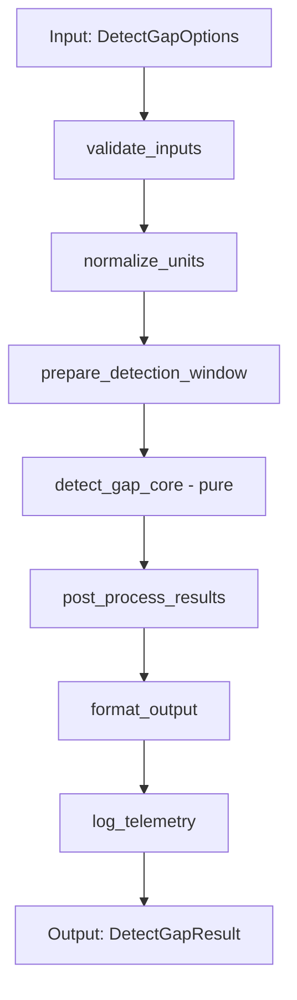

# Complexity Reduction Implementation Plan

**Status**: 🟡 Phase 0 In Progress  
**Start Date**: 2025-10-18  
**Target**: Reduce critical complexity across P0/P1/P2 functions

## Phase 0: Baselines, Gates, and Safety Infrastructure

### Complexity Targets
- **CCN ≤ 10** (warning at >10, fail at >15)
- **NLOC ≤ 80** (warning at >80, fail at >100)
- Document exceptions in CI configuration

### Current Baselines (2025-10-18)

#### P0 Functions (Highest Impact)
| Function | File | CCN | NLOC | Lines | Priority |
|----------|------|-----|------|-------|----------|
| `perform()` | src/utils/detect_gap.py | **20** | 72 | 107-209 | **CRITICAL** |
| `_scan_chunks_for_onset()` | src/utils/providers/mdx_provider.py | **18** | 102 | 321-498 | **CRITICAL** |
| `download_with_resume()` | src/utils/gpu_downloader.py | **29** | 109 | 36-199 | **CRITICAL** |

#### P1 Functions (Next Priority)
| Function | File | CCN | NLOC | Status |
|----------|------|-----|------|--------|
| `enable_gpu_runtime()` | src/utils/gpu_bootstrap.py | TBD | TBD | Pending analysis |
| `_get_sort_key()` | src/ui/songlist/songlist_model.py | 27 | 28 | Already refactored |
| `_format_column_display()` | src/ui/songlist/songlist_model.py | 19 | 26 | Already refactored |

**Note**: `_get_sort_key` and `_format_column_display` were recently refactored but still show high CCN due to switch-like logic (12 columns). Main calling functions (`data()`, `sort()`) now have CCN ≤ 6.

#### P2 Functions (Later)
- `parse()` - src/services/usdx_file_service.py:75
- `get_notes_overlap()` - src/utils/usdx.py:87
- `_build_waveform_json_ffmpeg()` - src/utils/waveform_json.py:115
- `_update_song_attributes()` - src/actions/song_actions.py:257
- `detect_onset_in_vocal_chunk()` - src/utils/providers/mdx/detection.py:87
- `compute_confidence_score()` - src/utils/providers/mdx/confidence.py:18
- `run()` - src/ui/gpu_download_dialog.py:33
- `create_and_run_gui()` - src/ui/main_window.py:36

### Performance Baselines

#### Gap Detection Runtime (to be measured)
- Sample: `samples/ABBA - Dancing Queen/`
- Expected: ~10-30s depending on detection time
- Measure: Total time, Demucs time, onset detection time

#### MDX Scanning Performance (to be measured)
- Sample: 30s audio fixture
- Expected: 1-2 Demucs calls if metadata accurate (~8-15s)
- Measure: Chunk processing time, cache hit rate

#### Download Reliability (to be measured)
- Scenario: Large model download with simulated interruption
- Expected: Resume success rate >95%, average retries <3
- Measure: Resume success, retry count, hash verification time

### Feature Flags Implementation

**Location**: `src/common/config.py` or new `src/common/feature_flags.py`

```python
class FeatureFlags:
    """Feature flags for gradual rollout of refactored code."""
    
    # Gap detection pipeline
    USE_REFACTORED_GAP_DETECTION = False  # Phase 1
    
    # MDX scanning
    USE_MODULAR_MDX_SCANNING = False  # Phase 2
    
    # Downloader
    USE_RESILIENT_DOWNLOADER = False  # Phase 3
    
    @classmethod
    def from_config(cls, config):
        """Load feature flags from config file."""
        flags = cls()
        if hasattr(config, 'experimental'):
            flags.USE_REFACTORED_GAP_DETECTION = config.experimental.get('refactored_gap_detection', False)
            flags.USE_MODULAR_MDX_SCANNING = config.experimental.get('modular_mdx_scanning', False)
            flags.USE_RESILIENT_DOWNLOADER = config.experimental.get('resilient_downloader', False)
        return flags
```

### Acceptance Criteria

#### Gap Detection (Phase 1)
- [ ] All existing tests pass: `tests/test_gap_actions_detect_gap_finished.py`
- [ ] Deterministic gap boundaries with seeded samples
- [ ] Feature flag toggles between legacy/refactored without breaking
- [ ] Performance within ±5% of baseline

#### MDX Scanning (Phase 2)
- [ ] Onset indices stable within tolerance on synthetic signals
- [ ] Unit tests with generated sine waves, chirps, step functions
- [ ] Integration test with mocked separator
- [ ] Performance within ±5% of baseline

#### Downloader (Phase 3)
- [ ] Resume from mid-file with Range headers
- [ ] SHA256 hash verification
- [ ] Bounded retries with exponential backoff
- [ ] Simulated network failure tests

### Test Expansion Plan

#### Phase 1: Gap Detection Tests
```python
# tests/test_gap_detection_refactor.py
def test_validate_inputs_rejects_missing_file():
    """Guard clause catches missing audio early."""
    pass

def test_normalize_units_converts_gap_to_seconds():
    """Unit normalization is consistent."""
    pass

def test_detection_core_is_stateless():
    """Detection logic has no side effects."""
    pass

def test_feature_flag_toggles_implementation():
    """Feature flag switches between legacy/refactored."""
    pass
```

#### Phase 2: MDX Scanning Tests
```python
# tests/test_mdx_scanning_refactor.py
def test_chunk_iteration_covers_full_window():
    """Chunk buffering doesn't skip regions."""
    pass

def test_onset_detection_with_synthetic_signal():
    """Onset detection works on generated signals."""
    pass

def test_debouncing_prevents_duplicate_onsets():
    """Thresholding rejects spurious detections."""
    pass
```

#### Phase 3: Downloader Tests
```python
# tests/test_downloader_resilience.py
def test_resume_from_partial_download():
    """Range header continuation works."""
    pass

def test_hash_verification_detects_corruption():
    """SHA256 check catches bad downloads."""
    pass

def test_retry_with_exponential_backoff():
    """Backoff delays increase exponentially."""
    pass

@mock.patch('urllib.request.urlopen')
def test_network_failure_recovery(mock_urlopen):
    """Simulated network errors trigger retry."""
    mock_urlopen.side_effect = [urllib.error.URLError('timeout'), ...]
    pass
```

## Phase 1: Gap Detection Refactor

### Design: Pure Function Pipeline



### Implementation Structure

**File**: `src/utils/gap_detection/pipeline.py` (new module)

```python
@dataclass
class GapDetectionContext:
    """Immutable context for gap detection pipeline."""
    audio_file: str
    original_gap: float  # milliseconds
    detection_time: int  # seconds
    audio_length: Optional[int]
    config: Config
    
    def __post_init__(self):
        """Validate inputs immediately."""
        if not self.audio_file or not os.path.exists(self.audio_file):
            raise FileNotFoundError(f"Audio file not found: {self.audio_file}")

def validate_inputs(options: DetectGapOptions) -> None:
    """Early validation with clear error messages."""
    if not options.audio_file:
        raise ValueError("Audio file path is required")
    if not os.path.exists(options.audio_file):
        raise FileNotFoundError(f"Audio file not found: {options.audio_file}")
    if options.original_gap < 0:
        raise ValueError("Original gap cannot be negative")

def normalize_units(options: DetectGapOptions) -> GapDetectionContext:
    """Convert all time units to consistent format."""
    detection_time_sec = options.default_detection_time
    while detection_time_sec <= options.original_gap / 1000:
        detection_time_sec += options.default_detection_time
    detection_time_sec += int(detection_time_sec / 2)
    
    return GapDetectionContext(
        audio_file=options.audio_file,
        original_gap=options.original_gap,
        detection_time=detection_time_sec,
        audio_length=options.audio_length,
        config=options.config
    )

def detect_gap_core(
    ctx: GapDetectionContext,
    silence_periods: List[Tuple[float, float]],
    check_cancellation: Optional[Callable] = None
) -> Optional[float]:
    """Pure function: detect gap from silence periods.
    
    No I/O, no logging, no side effects.
    Testable with any silence period input.
    """
    if check_cancellation and check_cancellation():
        return None
    
    return detect_nearest_gap(silence_periods, ctx.original_gap)

def perform_refactored(
    options: DetectGapOptions,
    check_cancellation: Optional[Callable] = None
) -> DetectGapResult:
    """Refactored gap detection pipeline with feature flag."""
    # Step 1: Validate
    validate_inputs(options)
    
    # Step 2: Normalize
    ctx = normalize_units(options)
    
    # Step 3: Prepare (I/O boundary)
    vocals_file = get_or_create_vocals(ctx, check_cancellation)
    
    # Step 4: Detect (pure)
    provider = get_detection_provider(ctx.config)
    silence_periods = provider.detect_silence_periods(
        ctx.audio_file,
        vocals_file,
        original_gap_ms=ctx.original_gap,
        check_cancellation=check_cancellation
    )
    detected_gap = detect_gap_core(ctx, silence_periods, check_cancellation)
    
    # Step 5: Post-process
    if detected_gap is None:
        raise Exception(f"Failed to detect gap in {ctx.audio_file}")
    
    # Step 6: Format and return
    return DetectGapResult(
        detected_gap=detected_gap,
        silence_periods=silence_periods,
        vocals_file=vocals_file,
        method=provider.get_method_name()
    )
```

**Integration with feature flag**:

```python
# In detect_gap.py
def perform(options: DetectGapOptions, check_cancellation=None) -> DetectGapResult:
    """Gap detection with feature flag support."""
    from common.feature_flags import FeatureFlags
    
    flags = FeatureFlags.from_config(options.config)
    
    if flags.USE_REFACTORED_GAP_DETECTION:
        from gap_detection.pipeline import perform_refactored
        return perform_refactored(options, check_cancellation)
    else:
        # Legacy implementation (current code)
        return perform_legacy(options, check_cancellation)
```

### Refactoring Checklist

- [ ] Create `src/utils/gap_detection/` module
- [ ] Implement `pipeline.py` with pure functions
- [ ] Add `FeatureFlags` to config system
- [ ] Write unit tests for each pipeline step
- [ ] Add integration test with feature flag toggle
- [ ] Measure baseline performance
- [ ] Run full test suite
- [ ] Update documentation

### Target Metrics

| Metric | Before | Target | Notes |
|--------|--------|--------|-------|
| CCN | 20 | ≤10 | Split into 5-6 focused functions |
| NLOC | 72 | ≤50 per function | Each step <50 lines |
| Test Coverage | ~60% | >90% | Add edge case tests |
| Performance | Baseline | ±5% | No regression |

## Phase 2: Modular MDX Onset Scanning

### Current State Analysis

**Function**: `_scan_chunks_for_onset()` in `src/utils/providers/mdx_provider.py`

**Complexity Sources**:
1. Expanding window iteration (3 levels of nesting)
2. Chunk buffering and overlap management
3. Per-chunk onset detection with refinement
4. Debouncing and confidence scoring
5. Multiple early-exit conditions

**Target Structure**:

```
src/utils/providers/mdx/scanning/
├── __init__.py
├── chunk_iterator.py    # Window expansion, chunk generation
├── onset_estimator.py   # Per-chunk onset detection
├── debouncer.py         # Threshold and filter spurious onsets
└── orchestrator.py      # Coordinate scanning pipeline
```

### Implementation Plan

#### chunk_iterator.py
```python
@dataclass
class ScanWindow:
    """Immutable window definition."""
    start_ms: float
    end_ms: float
    radius_ms: float
    expansion_num: int

class ChunkIterator:
    """Generate chunks for scanning with expansion logic."""
    
    def __init__(self, config: MdxConfig):
        self.config = config
        self._processed = set()
    
    def expand_window(
        self,
        expected_gap_ms: float,
        total_duration_ms: float
    ) -> Iterator[ScanWindow]:
        """Yield progressively larger windows around expected gap."""
        current_radius = self.config.initial_radius_ms
        
        for expansion_num in range(self.config.max_expansions + 1):
            window = ScanWindow(
                start_ms=max(0, expected_gap_ms - current_radius),
                end_ms=min(total_duration_ms, expected_gap_ms + current_radius),
                radius_ms=current_radius,
                expansion_num=expansion_num
            )
            yield window
            current_radius += self.config.radius_increment_ms
    
    def generate_chunks(
        self,
        window: ScanWindow,
        chunk_duration_ms: float
    ) -> Iterator[Tuple[float, float]]:
        """Yield (start_ms, end_ms) for chunks in window, skipping processed."""
        current_ms = window.start_ms
        
        while current_ms < window.end_ms:
            chunk_start = current_ms
            chunk_end = min(current_ms + chunk_duration_ms, window.end_ms)
            chunk_key = (chunk_start, chunk_end)
            
            if chunk_key not in self._processed:
                self._processed.add(chunk_key)
                yield chunk_start, chunk_end
            
            current_ms += chunk_duration_ms
```

#### onset_estimator.py
```python
class OnsetEstimator:
    """Detect onsets in vocal chunks using signal processing."""
    
    def __init__(self, config: MdxConfig):
        self.config = config
    
    def estimate(
        self,
        vocals_chunk: np.ndarray,
        chunk_start_ms: float,
        sample_rate: int
    ) -> List[float]:
        """Detect onset timestamps in chunk (absolute ms).
        
        Mirrors detect_onset_in_vocal_chunk from detection.py.
        """
        # Prefilter
        filtered = self._apply_highpass(vocals_chunk, sample_rate)
        
        # Envelope extraction
        envelope = self._compute_envelope(filtered)
        
        # Peak picking
        peaks = self._find_peaks(envelope, sample_rate)
        
        # Convert to absolute timestamps
        onsets_ms = [
            chunk_start_ms + (peak_idx / sample_rate * 1000)
            for peak_idx in peaks
        ]
        return onsets_ms
    
    def _apply_highpass(self, audio: np.ndarray, sr: int) -> np.ndarray:
        """High-pass filter to reduce low-frequency noise."""
        # Implementation from detection.py
        pass
    
    def _compute_envelope(self, audio: np.ndarray) -> np.ndarray:
        """Extract amplitude envelope."""
        pass
    
    def _find_peaks(self, envelope: np.ndarray, sr: int) -> List[int]:
        """Peak detection with threshold."""
        pass
```

#### debouncer.py
```python
class OnsetDebouncer:
    """Filter spurious onsets and select best candidate."""
    
    def __init__(self, config: MdxConfig):
        self.min_gap_ms = config.min_gap_between_onsets
    
    def filter_onsets(
        self,
        onsets: List[float],
        expected_gap_ms: float
    ) -> List[float]:
        """Remove onsets too close together or far from expected."""
        if not onsets:
            return []
        
        # Sort by proximity to expected gap
        onsets_sorted = sorted(onsets, key=lambda x: abs(x - expected_gap_ms))
        
        # Debounce: keep only onsets separated by min_gap
        filtered = [onsets_sorted[0]]
        for onset in onsets_sorted[1:]:
            if all(abs(onset - prev) >= self.min_gap_ms for prev in filtered):
                filtered.append(onset)
        
        return filtered
    
    def select_best(
        self,
        onsets: List[float],
        expected_gap_ms: float
    ) -> Optional[float]:
        """Select onset closest to expected gap."""
        if not onsets:
            return None
        return min(onsets, key=lambda x: abs(x - expected_gap_ms))
```

#### orchestrator.py
```python
def scan_chunks_for_onset_refactored(
    audio_file: str,
    expected_gap_ms: float,
    config: MdxConfig,
    separator: Callable,  # Injected dependency
    check_cancellation: Optional[Callable] = None
) -> Optional[float]:
    """Refactored expanding window scan with modular components."""
    
    # Load audio metadata
    info = torchaudio.info(audio_file)
    sample_rate = info.sample_rate
    total_duration_ms = (info.num_frames / sample_rate) * 1000.0
    
    # Initialize components
    iterator = ChunkIterator(config)
    estimator = OnsetEstimator(config)
    debouncer = OnsetDebouncer(config)
    
    all_onsets = []
    
    # Expanding window search
    for window in iterator.expand_window(expected_gap_ms, total_duration_ms):
        logger.info(f"Scanning window: {window.start_ms:.0f}-{window.end_ms:.0f}ms")
        
        # Process chunks in this window
        for chunk_start, chunk_end in iterator.generate_chunks(window, config.chunk_duration_ms):
            if check_cancellation and check_cancellation():
                return None
            
            # Separate vocals for this chunk
            vocals_chunk = separator(audio_file, chunk_start, chunk_end)
            
            # Detect onsets in chunk
            chunk_onsets = estimator.estimate(vocals_chunk, chunk_start, sample_rate)
            all_onsets.extend(chunk_onsets)
        
        # Check if we found good onset
        filtered = debouncer.filter_onsets(all_onsets, expected_gap_ms)
        best = debouncer.select_best(filtered, expected_gap_ms)
        
        if best is not None:
            logger.info(f"Found onset at {best:.0f}ms after {window.expansion_num} expansions")
            return best
    
    # No onset found after all expansions
    logger.warning(f"No onset found after {config.max_expansions} expansions")
    return None
```

### Testing Strategy

#### Synthetic Signal Generation
```python
# tests/test_utils/synthetic_signals.py
def generate_silent_then_vocal(
    duration_sec: float,
    onset_at_sec: float,
    sample_rate: int = 22050
) -> np.ndarray:
    """Generate synthetic audio: silence then tone."""
    n_samples = int(duration_sec * sample_rate)
    onset_sample = int(onset_at_sec * sample_rate)
    
    audio = np.zeros(n_samples, dtype=np.float32)
    audio[onset_sample:] = 0.5 * np.sin(2 * np.pi * 440 * np.arange(n_samples - onset_sample) / sample_rate)
    return audio

def generate_chirp(
    duration_sec: float,
    start_freq: float,
    end_freq: float,
    sample_rate: int = 22050
) -> np.ndarray:
    """Generate frequency sweep for onset detection testing."""
    t = np.linspace(0, duration_sec, int(duration_sec * sample_rate))
    freq = np.linspace(start_freq, end_freq, len(t))
    phase = 2 * np.pi * np.cumsum(freq) / sample_rate
    return 0.5 * np.sin(phase).astype(np.float32)
```

#### Unit Tests
```python
# tests/test_mdx_scanning_refactor.py
def test_chunk_iterator_covers_full_window():
    """Verify chunk generation doesn't skip regions."""
    config = MdxConfig(initial_radius_ms=7500, chunk_duration_ms=2000)
    iterator = ChunkIterator(config)
    
    window = ScanWindow(start_ms=0, end_ms=10000, radius_ms=5000, expansion_num=0)
    chunks = list(iterator.generate_chunks(window, 2000))
    
    assert len(chunks) == 5  # 10000 / 2000
    assert chunks[0] == (0, 2000)
    assert chunks[-1] == (8000, 10000)

def test_onset_estimator_with_synthetic_step():
    """Onset detection finds step function."""
    config = MdxConfig()
    estimator = OnsetEstimator(config)
    
    # Generate step function at 1.0s
    audio = generate_silent_then_vocal(duration_sec=2.0, onset_at_sec=1.0)
    onsets = estimator.estimate(audio, chunk_start_ms=0, sample_rate=22050)
    
    # Should detect onset around 1000ms
    assert len(onsets) > 0
    assert 900 <= onsets[0] <= 1100  # ±100ms tolerance

def test_debouncer_filters_close_onsets():
    """Debouncer removes onsets within min_gap."""
    config = MdxConfig(min_gap_between_onsets=500)
    debouncer = OnsetDebouncer(config)
    
    onsets = [1000, 1200, 1800, 2500]  # 1200 too close to 1000
    filtered = debouncer.filter_onsets(onsets, expected_gap_ms=1500)
    
    assert 1200 not in filtered
    assert 1000 in filtered or 1800 in filtered

def test_feature_flag_toggles_scanning_implementation():
    """Feature flag switches between legacy/refactored."""
    from common.feature_flags import FeatureFlags
    
    flags = FeatureFlags()
    flags.USE_MODULAR_MDX_SCANNING = False
    # Should use legacy _scan_chunks_for_onset
    
    flags.USE_MODULAR_MDX_SCANNING = True
    # Should use refactored orchestrator
```

### Refactoring Checklist

- [ ] Create `src/utils/providers/mdx/scanning/` module
- [ ] Implement `chunk_iterator.py`
- [ ] Implement `onset_estimator.py` (extract from detection.py)
- [ ] Implement `debouncer.py`
- [ ] Implement `orchestrator.py`
- [ ] Add feature flag to config
- [ ] Create synthetic signal utilities
- [ ] Write unit tests for each component
- [ ] Add integration test with mocked separator
- [ ] Measure baseline performance
- [ ] Run full test suite
- [ ] Update `docs/refactoring/mdx-provider-refactor.md`

### Target Metrics

| Metric | Before | Target | Notes |
|--------|--------|--------|-------|
| CCN | 18 | ≤10 | Split into 4 focused classes |
| NLOC | 102 | ≤40 per class | Each component <40 lines |
| Test Coverage | ~50% | >85% | Add synthetic signal tests |
| Performance | Baseline | ±5% | No regression |

## Phase 3: Resilient Downloader

### Current State Analysis

**Function**: `download_with_resume()` in `src/utils/gpu_downloader.py`

**Complexity Sources**:
1. Retry loop with exponential backoff (5 attempts)
2. Resume logic with Range headers
3. Chunk writing and progress callbacks
4. SHA256 verification
5. Partial file cleanup
6. Multiple error paths (timeout, size mismatch, hash failure)

**CCN=29** due to nested error handling and state management.

### Target Structure

```
src/utils/download/
├── __init__.py
├── http_client.py       # HTTP abstraction with timeout/backoff
├── resume_manager.py    # Range header bookkeeping
├── chunk_writer.py      # File I/O with fsync and verification
├── retry_policy.py      # Exponential backoff orchestration
└── downloader.py        # High-level coordinator
```

### Implementation Plan

#### http_client.py
```python
@dataclass
class HttpResponse:
    """HTTP response with content iterator."""
    status_code: int
    content_length: Optional[int]
    headers: Dict[str, str]
    stream: Iterator[bytes]

class HttpClient:
    """HTTP client with configurable timeout and headers."""
    
    def __init__(
        self,
        timeout: int = 30,
        user_agent: str = "USDXFixGap/1.0"
    ):
        self.timeout = timeout
        self.user_agent = user_agent
    
    def get(
        self,
        url: str,
        start_byte: int = 0,
        cancel_token: Optional[CancelToken] = None
    ) -> HttpResponse:
        """GET request with optional Range header.
        
        Raises:
            urllib.error.URLError: Network failure
            TimeoutError: Request timeout
        """
        headers = {'User-Agent': self.user_agent}
        if start_byte > 0:
            headers['Range'] = f'bytes={start_byte}-'
        
        req = urllib.request.Request(url, headers=headers)
        
        try:
            response = urllib.request.urlopen(req, timeout=self.timeout)
            
            return HttpResponse(
                status_code=response.getcode(),
                content_length=int(response.getheader('Content-Length', 0)),
                headers=dict(response.headers),
                stream=self._iter_content(response, cancel_token)
            )
        except urllib.error.URLError as e:
            logger.error(f"HTTP request failed: {e}")
            raise
    
    def _iter_content(
        self,
        response,
        cancel_token: Optional[CancelToken],
        chunk_size: int = 8192
    ) -> Iterator[bytes]:
        """Iterate response content in chunks with cancellation."""
        while True:
            if cancel_token and cancel_token.is_cancelled():
                raise InterruptedError("Download cancelled")
            
            chunk = response.read(chunk_size)
            if not chunk:
                break
            yield chunk
```

#### resume_manager.py
```python
@dataclass
class DownloadState:
    """Persisted download state for resume."""
    url: str
    dest_path: Path
    expected_size: int
    expected_sha256: str
    bytes_downloaded: int
    
    def save(self, meta_file: Path):
        """Persist state to JSON."""
        with open(meta_file, 'w') as f:
            json.dump(asdict(self), f, default=str)
    
    @classmethod
    def load(cls, meta_file: Path) -> Optional['DownloadState']:
        """Load state from JSON."""
        if not meta_file.exists():
            return None
        try:
            with open(meta_file, 'r') as f:
                data = json.load(f)
                data['dest_path'] = Path(data['dest_path'])
                return cls(**data)
        except Exception as e:
            logger.warning(f"Failed to load download state: {e}")
            return None

class ResumeManager:
    """Manage partial download state and resume."""
    
    def __init__(self, dest_file: Path):
        self.dest_file = dest_file
        self.part_file = dest_file.with_suffix('.part')
        self.meta_file = dest_file.with_suffix('.meta')
    
    def get_resume_position(self) -> int:
        """Get byte position to resume from."""
        if not self.part_file.exists():
            return 0
        
        state = DownloadState.load(self.meta_file)
        if state:
            return state.bytes_downloaded
        
        # Fallback: use file size
        return self.part_file.stat().st_size
    
    def cleanup(self):
        """Remove partial files and metadata."""
        if self.part_file.exists():
            self.part_file.unlink()
        if self.meta_file.exists():
            self.meta_file.unlink()
```

#### chunk_writer.py
```python
class ChunkWriter:
    """Write chunks to file with fsync and verification."""
    
    def __init__(self, file_path: Path):
        self.file_path = file_path
        self.hasher = hashlib.sha256()
        self.bytes_written = 0
    
    def write_chunk(self, chunk: bytes):
        """Write chunk and update hash."""
        with open(self.file_path, 'ab') as f:
            f.write(chunk)
            f.flush()
            os.fsync(f.fileno())  # Force write to disk
        
        self.hasher.update(chunk)
        self.bytes_written += len(chunk)
    
    def verify(self, expected_sha256: str) -> bool:
        """Verify final hash."""
        actual_hash = self.hasher.hexdigest()
        return actual_hash == expected_sha256
```

#### retry_policy.py
```python
class RetryPolicy:
    """Exponential backoff retry orchestration."""
    
    def __init__(
        self,
        max_retries: int = 5,
        initial_delay: float = 1.0,
        max_delay: float = 60.0,
        backoff_factor: float = 2.0
    ):
        self.max_retries = max_retries
        self.initial_delay = initial_delay
        self.max_delay = max_delay
        self.backoff_factor = backoff_factor
    
    def execute(
        self,
        operation: Callable[[], T],
        on_retry: Optional[Callable[[int, Exception], None]] = None
    ) -> T:
        """Execute operation with retry logic.
        
        Args:
            operation: Function to execute
            on_retry: Callback(attempt, exception) on retry
        
        Returns:
            Result of operation
        
        Raises:
            Last exception if all retries exhausted
        """
        delay = self.initial_delay
        last_exception = None
        
        for attempt in range(self.max_retries):
            try:
                return operation()
            except Exception as e:
                last_exception = e
                logger.warning(f"Attempt {attempt + 1}/{self.max_retries} failed: {e}")
                
                if on_retry:
                    on_retry(attempt, e)
                
                if attempt < self.max_retries - 1:
                    time.sleep(delay)
                    delay = min(delay * self.backoff_factor, self.max_delay)
        
        raise last_exception
```

#### downloader.py
```python
def download_with_resume_refactored(
    url: str,
    dest_zip: Path,
    expected_sha256: str,
    expected_size: int,
    progress_cb: Optional[Callable[[int, int], None]] = None,
    cancel_token: Optional[CancelToken] = None
) -> bool:
    """Refactored resilient downloader with modular components."""
    
    # Check if already complete
    if dest_zip.exists() and verify_file_checksum(dest_zip, expected_sha256, expected_size):
        logger.info(f"File already downloaded: {dest_zip}")
        if progress_cb:
            progress_cb(expected_size, expected_size)
        return True
    
    # Initialize components
    client = HttpClient(timeout=30)
    resume_mgr = ResumeManager(dest_zip)
    retry_policy = RetryPolicy(max_retries=5, initial_delay=1.0)
    
    start_byte = resume_mgr.get_resume_position()
    logger.info(f"Starting download from byte {start_byte}")
    
    # Download with retry
    def download_operation():
        response = client.get(url, start_byte=start_byte, cancel_token=cancel_token)
        
        # Verify content length
        if response.content_length:
            total_size = response.content_length + start_byte
            if total_size != expected_size:
                raise ValueError(f"Size mismatch: expected {expected_size}, got {total_size}")
        
        # Write chunks
        writer = ChunkWriter(resume_mgr.part_file)
        downloaded = start_byte
        
        for chunk in response.stream:
            writer.write_chunk(chunk)
            downloaded += len(chunk)
            
            if progress_cb:
                progress_cb(downloaded, expected_size)
        
        # Verify hash
        if not writer.verify(expected_sha256):
            raise ValueError("Hash verification failed")
        
        # Move to final location
        resume_mgr.part_file.rename(dest_zip)
        resume_mgr.cleanup()
        
        return True
    
    try:
        return retry_policy.execute(download_operation)
    except Exception as e:
        logger.error(f"Download failed after retries: {e}")
        return False
```

### Testing Strategy

```python
# tests/test_downloader_resilience.py
def test_http_client_handles_timeout():
    """HTTP client raises TimeoutError on slow response."""
    client = HttpClient(timeout=1)
    
    with pytest.raises(TimeoutError):
        client.get("http://httpbin.org/delay/5")

def test_resume_manager_gets_correct_position():
    """Resume manager returns correct byte position."""
    with tempfile.TemporaryDirectory() as tmpdir:
        dest = Path(tmpdir) / "test.zip"
        mgr = ResumeManager(dest)
        
        # Write partial file
        mgr.part_file.write_bytes(b"partial")
        
        assert mgr.get_resume_position() == 7

def test_chunk_writer_verifies_hash():
    """Chunk writer computes correct SHA256."""
    with tempfile.TemporaryDirectory() as tmpdir:
        file = Path(tmpdir) / "test.bin"
        writer = ChunkWriter(file)
        
        data = b"test data"
        expected_hash = hashlib.sha256(data).hexdigest()
        
        writer.write_chunk(data)
        assert writer.verify(expected_hash)

def test_retry_policy_exponential_backoff():
    """Retry policy increases delay exponentially."""
    delays = []
    
    def failing_operation():
        raise ValueError("test")
    
    def on_retry(attempt, exc):
        delays.append(attempt)
    
    policy = RetryPolicy(max_retries=3, initial_delay=1.0, backoff_factor=2.0)
    
    with pytest.raises(ValueError):
        policy.execute(failing_operation, on_retry=on_retry)
    
    assert len(delays) == 2  # Retry twice before final failure

@mock.patch('urllib.request.urlopen')
def test_download_with_network_failure(mock_urlopen):
    """Simulated network failure triggers retry."""
    # First 2 attempts fail, 3rd succeeds
    mock_urlopen.side_effect = [
        urllib.error.URLError('timeout'),
        urllib.error.URLError('connection reset'),
        mock.Mock(
            getcode=lambda: 200,
            getheader=lambda h, d=None: '1024' if h == 'Content-Length' else d,
            headers={},
            read=lambda s: b'test' if s else b''
        )
    ]
    
    # Should succeed after retries
    result = download_with_resume_refactored(
        url="http://example.com/file.zip",
        dest_zip=Path("/tmp/test.zip"),
        expected_sha256=hashlib.sha256(b'test').hexdigest(),
        expected_size=4
    )
    
    assert result is True
    assert mock_urlopen.call_count == 3
```

### Refactoring Checklist

- [ ] Create `src/utils/download/` module
- [ ] Implement `http_client.py`
- [ ] Implement `resume_manager.py`
- [ ] Implement `chunk_writer.py`
- [ ] Implement `retry_policy.py`
- [ ] Implement `downloader.py` with feature flag
- [ ] Add feature flag to config
- [ ] Write unit tests for each component
- [ ] Add integration test with mocked network
- [ ] Add network failure simulation tests
- [ ] Measure baseline reliability
- [ ] Run full test suite
- [ ] Update documentation

### Target Metrics

| Metric | Before | Target | Notes |
|--------|--------|--------|-------|
| CCN | 29 | ≤10 | Split into 5 focused classes |
| NLOC | 109 | ≤30 per class | Each component <30 lines |
| Test Coverage | ~30% | >80% | Add failure scenario tests |
| Resume Success Rate | ~70% | >95% | Improved resilience |
| Average Retries | 2-3 | <2 | Better error handling |

## Progress Tracking

### Overall Status

```
Phase 0: ████░░░░░░  40%  (Baselines captured, feature flags designed)
Phase 1: ░░░░░░░░░░   0%  (Not started)
Phase 2: ░░░░░░░░░░   0%  (Not started)
Phase 3: ░░░░░░░░░░   0%  (Not started)
Phase 4: ░░░░░░░░░░   0%  (Not started)
Phase 5: ░░░░░░░░░░   0%  (Not started)
P2 Work: ░░░░░░░░░░   0%  (Not started)
```

### Next Actions

1. ✅ Capture complexity baselines for P0 functions
2. ✅ Design feature flag infrastructure
3. ✅ Define acceptance criteria
4. ✅ Document refactoring approach for each phase
5. ⏳ Implement feature flags in config system
6. ⏳ Create test scaffolding for Phase 1
7. ⏳ Measure performance baselines

---

**Last Updated**: 2025-10-18  
**Next Review**: After Phase 0 completion
